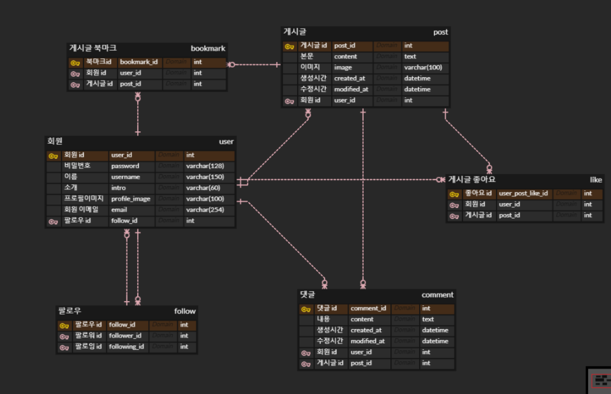

### 내일배움캠프 2번째 프로젝트
# Insta_Clone
## 트러블 슈팅
https://bolder-starburst-a73.notion.site/insta_clone_def-error-309bf99d2f3f4fd48bf235ec98ee629c

## ****프로젝트 핵심 목적****

- 클론코딩에서 요구하는 핵심기능을 연습
-  Generic이 아닌 def view로 작성 연습

## ****🎈 기능 명세서****

- HTML/CSS/Javascript를 활용한 프론트엔드 페이지 구성
- 사용자 환경(회원가입, 로그인, 로그아웃 등)
- 게시글 작성, 보여주기, 수정, 삭제 기능 구현(사진업로드)
- 댓글 작성, 보여주기, 수정, 삭제 기능 구현
- 좋아요, 팔로우 기능 구현

# ⚙ 개발환경
## back-end :  

## front-end :    

## ****🕸 와이어 프레임****

## ****🎯 데이터베이스****

## ****🎨 API 설계****

